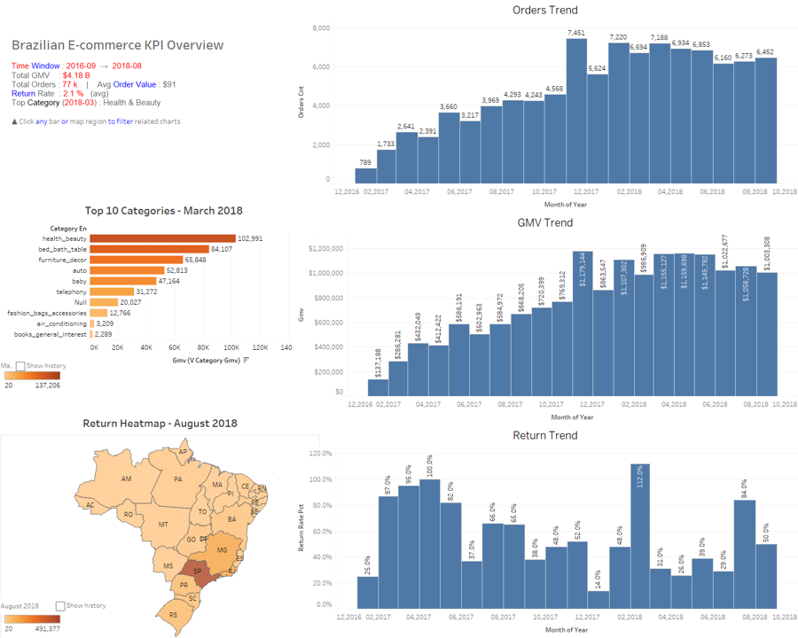

# Brazilian E-commerce KPI Dashboard  
_A SQL + Tableau mini-stack_



## 1 · Project Goal
Build a **one-page management dashboard** that tracks the core health metrics of a Brazilian e-commerce marketplace  
(GMV • Orders • AOV • Return Rate • Category mix • Geographic mix)  
using nothing but open data, pure SQL and Tableau Desktop.

<table>
<tr><td><b>Data Source</b></td><td><a href="https://www.kaggle.com/datasets/olistbr/brazilian-ecommerce">Brazilian E-commerce Public Dataset by Olist</a></td></tr>
<tr><td><b>Code / Data Pipeline</b></td><td>MySQL 8 + SQL window functions <br><code>ddl & etl & views</code> in <code>/sql</code></td></tr>
<tr><td><b>Visualisation</b></td><td>Tableau Desktop (packaged workbook <code>.twbx</code>)</td></tr>
</table>


---

## 2 · Repository Layout

```

EcomSalesKPIDashboard/
├── data/                 # raw CSVs from Kaggle 
│   └── olist\_\*.csv
├── sql/
│   ├── ddl\_create\_tables.sql      # create 9 core tables
│   ├── load\_data.sql              # LOAD DATA LOCAL INFILE … into MySQL
│   ├── etl\_clean\_derive.sql       # add virtual columns, date dimension, daily fact
│   └── views\_kpi.sql              # 7 analysis views (GMV, Orders, Returns…)
├── tableau/
│   └── EcomSalesKPIDashboard.twbx # packaged workbook (no password stored)
├── assets/
│   └── dashboard.png              # static preview for GitHub README
└── README.md

````


---

## 3 · Quick Start (5 commands)

```bash
# 1) create database
mysql -uroot -p -e "CREATE DATABASE IF NOT EXISTS EcomSalesKPIDashboard DEFAULT CHARSET=utf8mb4;"

# 2) tables
mysql -uroot -p EcomSalesKPIDashboard < sql/ddl_create_tables.sql

# 3) load raw CSVs (needs  SET GLOBAL local_infile = 1;)
mysql -uroot -p EcomSalesKPIDashboard < sql/load_data.sql

# 4) derive daily fact & dimensions
mysql -uroot -p EcomSalesKPIDashboard < sql/etl_clean_derive.sql

# 5) create analysis views
mysql -uroot -p EcomSalesKPIDashboard < sql/views_kpi.sql
````

Open **Tableau Desktop** → **Connect ▸ MySQL** (`localhost:3306`, database `EcomSalesKPIDashboard`)
and point every worksheet to the corresponding view.

---

## 4 · Core Metrics (Aug-2018)

| Metric                  |           Value |
| ----------------------- | --------------: |
| **GMV**                 | **\$1 003 308** |
| **Orders**              |           6 452 |
| **Average Order Value** |           \$156 |
| **Return Rate**         |          50.0 % |
| **#1 Category**         | Health & Beauty |

*(metrics auto-refresh in Tableau, live connection)*

---

## 5 · Next Steps

* 🟦 Add rolling-3 months MoM / YoY once earlier months are back-filled
* 🟧 Plug SHAP-based churn model (Telco Churn flagship) into the same dashboard
* 🟩 Rewrite ETL in dbt + schedule with Airflow

---

## 6 · Acknowledgements

* [Olist](https://www.olist.com/) for releasing the dataset
* Tableau Public Community for endless dashboard inspiration


# Raw data
Download all *olist_* CSVs (≈19 MB) from Kaggle into `data/` before running SQL.
